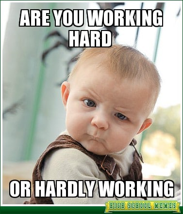

# A normal work schedule:

A normal work schedule, ideally, would look like 7 hours of coding and developing new features, 1 hour of a paid lunch break, and a short commute home. Unfortunately, for most employers, it may look more like 4 hours of debugging, another hour reading code, one more scouring documentation, 30 minutes combined time doomscrolling social media, and 30 more minutes of actual coding and development. In such a bogged-down and messy work schedule, it is important to keep track of how you spend your time developing projects. Not just for bookkeeping, but also for future project planning.

## The results are in...

I made my estimates based on pure memory and reviewing the code and commits I deployed. If I looked at a piece of code I had written and cringed a little inside, it was usually a sign that that part of the project took longer than expected. For example, implementing the edit profile page was pretty straightforward once I had already completed the create profile page, just a few edits on a React form, a quick test of database actions, and it was all good to go. However, something like the matching page was a little more challenging, as I not only had to debug, but I also had to plan the functionality of the page, design the page exactly how I wanted it to be, and refactor messy code. I also had to figure out how I was going to implement the algorithm for the page. Looking back now, though, I think I definitely could have completed my work in less time if I really focused more in the future.

Keeping track of my time made me realize how important time management is in a project, as getting sidetracked or distracted can break work momentum. On top of all that, it is also important to find what tasks are of the highest priority, in order to spend time the most efficiently. I usually go through my projects step by step and wing each step; however, as I mature in developing computer software, I will have to begin planning my projects better.

## The game plan for next time:

Next time, I would do things differently, such as using AI tools to generate more code scaffolding and prototypes. In this way, I could easily test and see if my ideas were viable before implementing more complex features. This strategy has worked for some projects for me in the past, as seeing progress unfold on the screen in front of me makes me more eager to continue work, as opposed to being stuck on a feature or bug for a few hours. I think tracking my time really made me reflect and think about how to use my time more efficiently in the future. AI tools now make long hours of debugging and finding documentation a thing of the past, and have allowed me to unleash my ideas at a faster pace. In the future, I hope to use actual tools to track my efforts instead of guessing, and I hope to be using less time to create more of what I love.

