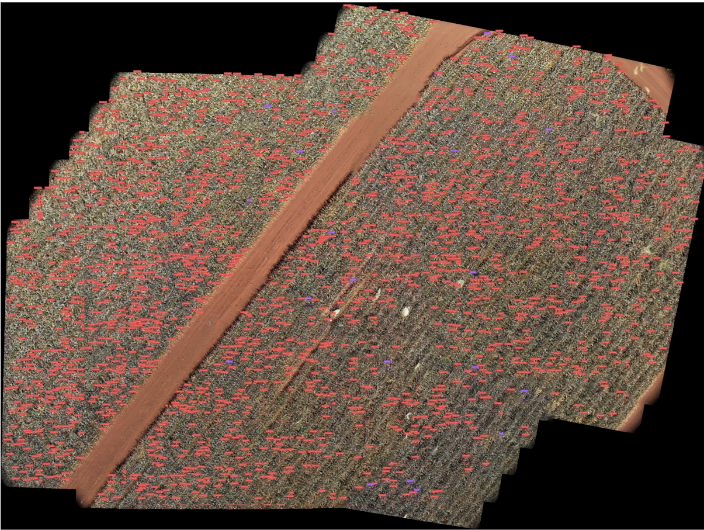

  
  

The Farm Robotic Challenge is a competition for college teams challenging students to use engineering skills in robotics, software, and hardware to tackle real world farming and agricultural issues. Out of 36 colleges in the 2025 competition, my team under the University of Hawaii at Manoa, Aina Robotics, and our robotics product won the second overall award and prize money. 

Our team focused on implementing a computer vision system in both a land rover and drone in order to provide farmers on Dole's Oahu pineapple plantation with statistical harvest data. This would allow farmers to combat labor shortages through better optimization of labor timing.

While our land rover would traverse pineapple fields with a camera and provide farmers statistics about the volume of pineapples, our drone would fly overhead with a camera and snap many photos of pineapple fields. For our land rover, Cobalt 3D reconstruction was used to take image and video data and create a virtual 3D model of individual pineapples, which would then be used to calculute the 3D volume of the pineapple. For our drone, using Python's OpenCV library and Roboflow, agricultural field images taken by the drone would be stiched together at first. Stiched images were then ran through an object detection model trained on pineapple data that would provide statistical feedback on ripe pineapples ready to harvest.

As a member of the computer vision team, I collborated with other members to develop the computer vision pipeline that would take and stich together drone images. I led the research for object detection models trained on pineapple data, where I recommended off-the-shelf models already trained and hosted on Roboflow, which contributed to our award winning project. Additionally, I ensured the quaility of image data was upheld through the stiching process, and I ran statistical measures on our object detection model which helped to measure the effectiveness of our model.

You can learn more at the [Pineapple powerhouse: Students’ high-flying farm tech wins international award](https://www.hawaii.edu/news/2025/05/13/farm-robotics-challenge-2025-winner/) and our [Github repo](https://github.com/CIRP-Lab/uhm_frc).
