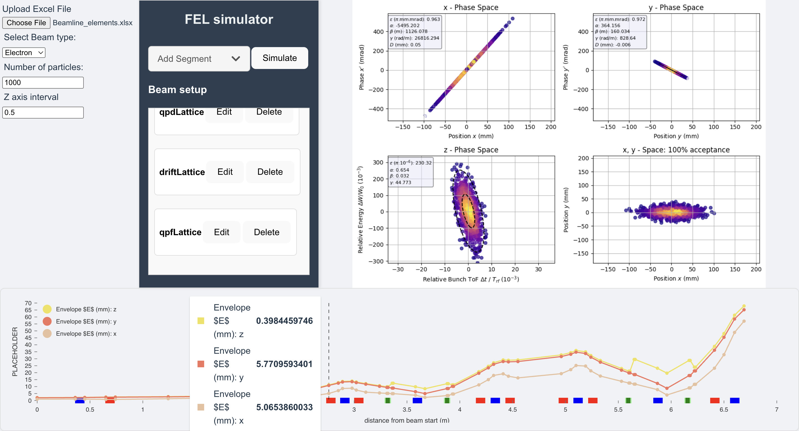

  

A free electron laser (FEL) is a device used by physicists to accelerate electrons through a gun using magnets. Physicists accelerate electrons to relativistic speeds and can measure radiation emitted by the electrons by introducing different variables. The movement of electrons and the changing of their properties through a beamline can be simulated if the beamline elements and their transport matrix are known. 

For my work at the Physics and Astronomy department at the University of Hawaii at Manoa, I developed a backend Python framework that utilizes Matplotlib, OOP, and matrix matrix multiplcation to visualize the movement of electron particles as they move through the FEL. Not only are you able to see how electrons change on the x and y plane, but you are also able to see other physical properties, such as alpha rate of change. My project also includes an optimization library so that users can find parameters for beamline elements (ex. current supplied to a magnet, length of a vacuum section) that shape the movement of electrons to the user's liking. This Python backend framework has helped physics professors at the University of Hawaii to write research papers for publishing and for display at a particle physics conference.

I am also currently implementing a frontend using Javascript and React that will allow for a more user friendly experience when running simulations on the a beamline to simulate. The frontend interacts with my Python backend using the FAST Api library.

You can learn more at [Reigniting UH’s Free Electron Laser](https://research.hawaii.edu/noelo/reigniting-uhs-free-electron-laser/).
