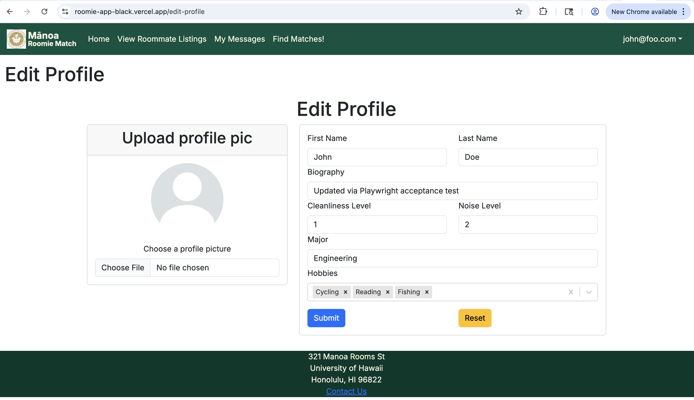
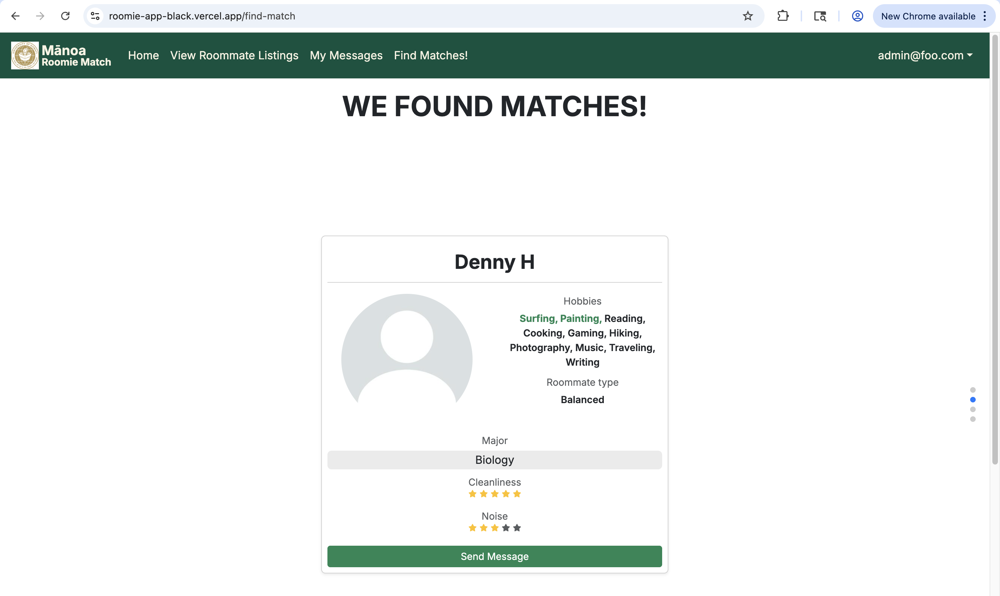
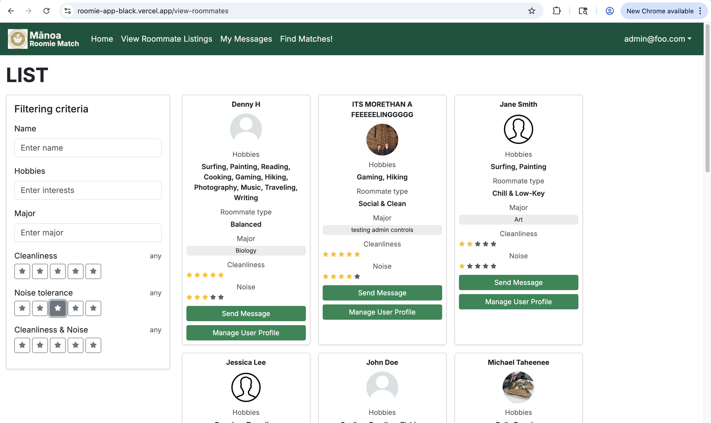

  
  
  

For this class project, 3 other students and I created Manoa Roomie Match, a website to help UH students living near or on campus with finding good roommates. The problem we saw was that many students at UH were having trouble finding rooming partners that matched their own living preferences, causing conflict and issues. Our website fixes that issue by creating a platform for finding roommates that students can connect with.

The website begins by having a student create an account with their UH email. The user then continues creating their profile by adding information about themselves, such as hobbies, major, and most importantly, living standards. This information will allow our matching algorithm to match the student with other students with similar living preferences, hobbies, and majors. If users don't like the students we have matched with them, they can go to our search page to view other roommates and filter students by their own preferences.

My contributions to the project included creating the Student model for our Postgres database, creating mockup pages as a prototype of our website, and implementing several other pages. Pages I implemented included the profile creation page, the profile editing page, the roommate matching page, and the admin user management page. 

I learned a lot during this project. Even though I had already been working on software projects for a year, this was my first project working in a big team in tandem to meet a deadline. It got messy at times, too. For instance, I made an error when creating the Student Prisma ORM model, and when I pushed these changes to main, it broke our deployment on Vercel, forcing our team to urgently change the rest of the repository. Additionally, there was a commit I made that did not follow ESLint coding standards, causing the entire deployment to crash on Vercel once again. Although I made mistakes, I learned a lot from them and will handle group project changes with more care next time. 

During this project, I also learned to be adaptive. When creating the profile creation page, I had to use third-party software to handle storing user profile pictures. Even though we weren't taught this software in class, I learned how to create a Supabase storage that could hold the profile pictures of users. This ultimately taught me that in software projects, I will have to be adaptive and self-motivated to find solutions. Additionally, this entire project taught me about not just creating code that works, but also code that is clean and follows proper coding standards.

You can learn more at [our Github organization page](https://manoa-roomie-match.github.io/).
